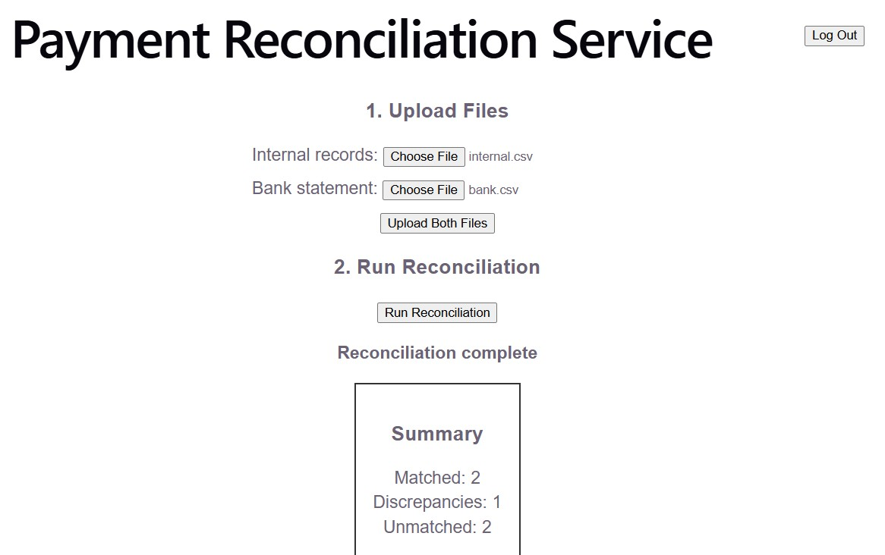

# Payment Reconciliation Service


A full-stack payment reconciliation system that matches transactions between internal records and external bank statements, flags discrepancies, and reports the results. Secured with JWT authentication.

## Live Demo

**App:** https://payment-reconciliation-service.vercel.app

**Demo login** — username: `demo` · password: `demo123`




> Note: the backend is hosted on a free tier and sleeps after inactivity, so the first request may take up to ~50 seconds to wake the server. Subsequent requests are fast.

## What it does

Reconciliation is the back-office process of confirming that a company's own record of transactions matches what actually settled at the bank. This service ingests two sets of transactions (internal records and a bank statement), matches them, and surfaces anything that doesn't line up.

It handles the three real outcomes of reconciliation:
- **Matched** — same reference and amount on both sides
- **Discrepancy** — same reference but a different amount (a genuine red flag)
- **Unmatched** — a transaction that exists on only one side (missing on the other)

## Features

- CSV ingestion of internal and bank transaction files
- A matching engine that reconciles by reference and amount, using `BigDecimal` for exact money comparisons
- Discrepancy detection and categorised reporting
- JWT authentication with Spring Security (protected endpoints, hashed passwords, stateless tokens)
- React dashboard to upload files, run reconciliation, and review results
- Idempotent import so re-running does not create duplicate records

## Tech Stack

| Layer | Technology |
|----------|--------------------------------|
| Backend | Java 21, Spring Boot, Spring Data JPA, Spring Security |
| Auth | JWT (jjwt) |
| Database | PostgreSQL |
| Frontend | React (Vite) |
| Build & Deploy | Maven, Docker, Render (backend + DB), Vercel (frontend) |
| Testing | JUnit 5, Mockito |

## API Overview

| Method | Endpoint | Description |
|--------|----------------------------------|--------------------------------|
| `POST` | `/api/auth/register` | Register a user |
| `POST` | `/api/auth/login` | Log in, returns a JWT |
| `POST` | `/api/transactions/import` | Import a CSV (source: INTERNAL or BANK) |
| `DELETE`| `/api/transactions/clear` | Clear all transactions |
| `POST` | `/api/reconciliation/run` | Run reconciliation, returns a summary |
| `GET` | `/api/transactions/matched` | List matched transactions |
| `GET` | `/api/transactions/unmatched` | List unmatched transactions |
| `GET` | `/api/transactions/discrepancies`| List discrepancies |

All endpoints except `/api/auth/**` require a valid JWT in the `Authorization: Bearer <token>` header.

## CSV Format

```
reference,amount,transactionDate,description
TXN001,100.00,2026-06-29,Payment to supplier
TXN002,250.50,2026-06-29,Invoice payment
```

## Running Locally

### Prerequisites
- Java 21, Maven, PostgreSQL, Node.js

### Backend
1. Create a PostgreSQL database named `reconciliation`.
2. Set your database password as an environment variable `DB_PASSWORD` (the app reads it from the environment, it is never committed).
3. From the `backend` folder: `./mvnw spring-boot:run`
4. API runs at `http://localhost:8080`.

### Frontend
1. From the `frontend` folder: `npm install` then `npm run dev`
2. App runs at `http://localhost:5173`.

## Testing

Unit tests cover the matching engine (matched, discrepancy, and unmatched cases) using JUnit 5 and Mockito, mocking the repository to test the logic in isolation.

```
cd backend
./mvnw test
```

## Design Notes

- **Money is handled with `BigDecimal`** and compared with `compareTo()`, never `double`, to avoid floating-point rounding errors.
- **Passwords are hashed** with BCrypt; plain-text passwords are never stored.
- **Authentication is stateless** via JWT, each request carries its own token, which scales cleanly.
- In production, the internal side would come directly from the company's transaction database and the bank side from a daily settlement file (CSV, MT940, etc.); a natural extension is to replace the file upload with a direct bank API integration for near-real-time reconciliation.

## License

MIT — see [LICENSE](LICENSE).